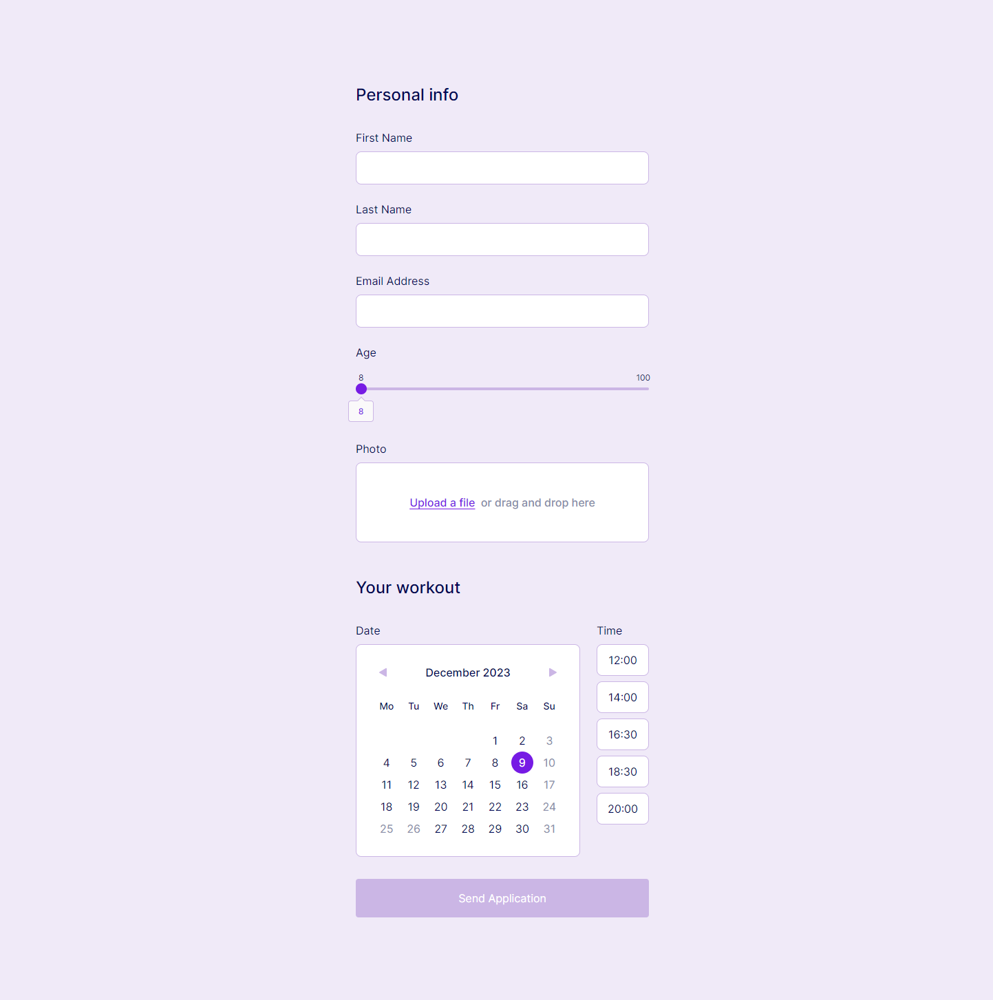

# Form (based on Figma)

[Open App](https://think1-form.vercel.app/ "Form") 

## Requirements

✅ React (used Next.js 14)
✅ TypeScript
✅ Tailwind
✅ Responsive web design
❌ Not using form libraries, e.g. Formik

  

